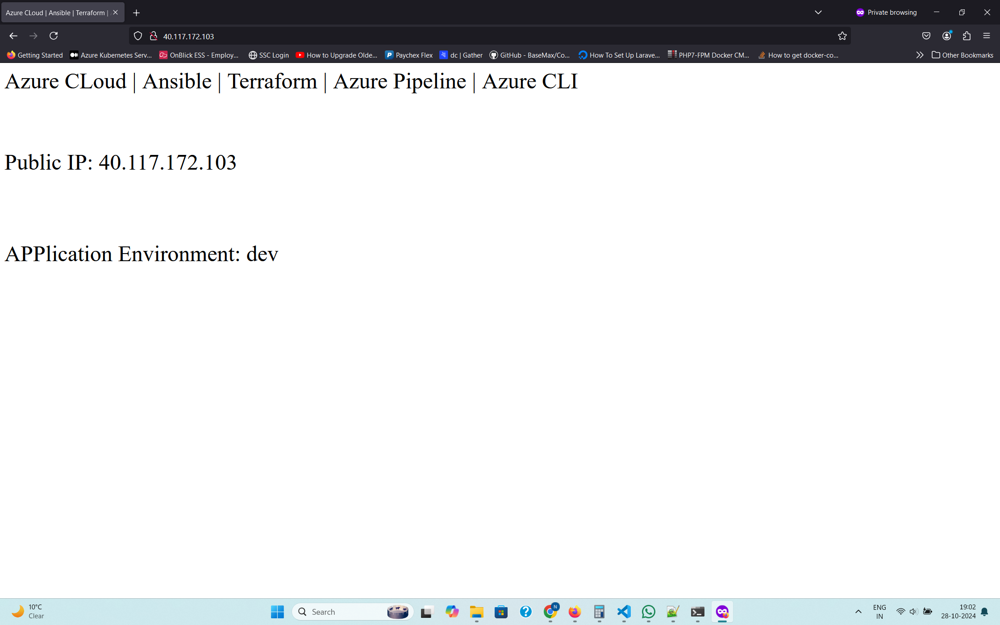
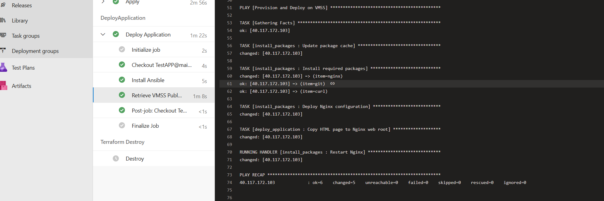
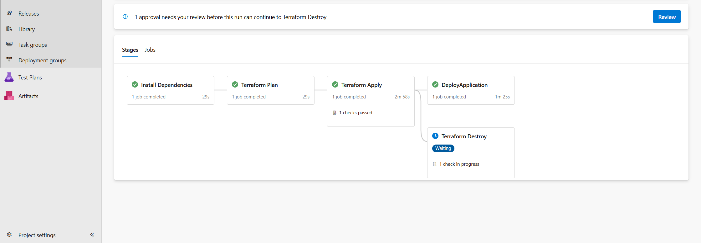
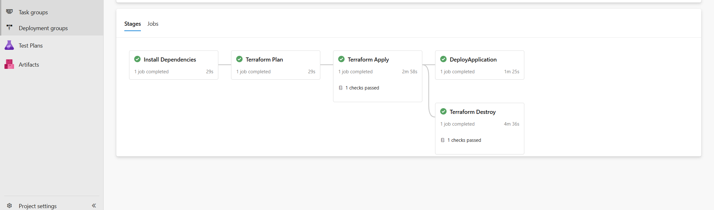

Webpage After Deployment:
 

  
Ansible Script as part of the pipeline:
 

  

Azure Pipeline:
 

  

Azure Pipeline:
 

  

Overview

This Azure DevOps YAML pipeline deploys infrastructure and applications across multiple stages using Terraform, Ansible, and Azure CLI. 
It includes stages to install dependencies, plan and apply infrastructure, deploy the application, and clean up resources.
Pipeline Structure
Parameters and Variables

    Parameters:
        environment: Defines the environment (dev, test, prod) for deployment.

    Variables:
        Template-based variables file: appConfig/${{ parameters.environment }}.yaml
        Secret group: appsecrets for securely handling sensitive data like usernames and passwords.

Stages
1. Install Dependencies

Purpose: Sets up Git, Azure CLI, and Terraform.

Job: Install

    Updates system packages.
    Installs essential tools:
        Git: Version control.
        Azure CLI: Manages Azure resources.
        Terraform: Infrastructure as Code tool.
    Verification: Each tool’s version is printed for confirmation.

2. Terraform Plan

Purpose: Initializes and runs terraform plan to prepare an execution plan.

Dependencies: Runs after InstallDependencies stage.

Job: Plan

    Initializes Terraform and switches/creates the workspace based on environment.
    Exports environment variables (admin credentials) from the Azure Key Vault.
    Runs terraform plan using environment-specific variables from env_vars/${{ parameters.environment }}.tfvars.
    Output: A saved plan file (tfplan) for the Terraform Apply stage.

3. Terraform Apply

Purpose: Applies the previously created Terraform plan to deploy resources.

Dependencies: Runs after TerraformPlan stage and only if it succeeds.

Job: Apply

    Executes terraform apply on the saved tfplan file.
    Automatically approves (-auto-approve) to proceed without manual confirmation.

4. Deploy Application

Purpose: Downloads and deploys the application using Ansible.

Dependencies: Runs after TerraformApply.

Job: Download_Deploy_Application

    Install Ansible: Ensures Ansible is available for configuration management.
    Retrieve Public IP:
        Uses Azure CLI to get the public IP of the deployed VMSS instance.
        Sets this IP as a pipeline variable (publicIpAddress) for later use.
    Temporary Inventory:
        Dynamically creates an Ansible inventory file with retrieved IP and credentials.
        Disables SSH host key checking for easier access during initial deployment.
    Run Ansible Playbook:
        Executes ansible-playbook using the temporary inventory and extra variables (env and public_ip).

5. Terraform Destroy

Purpose: Removes deployed infrastructure to save resources and maintain a clean environment.

Dependencies: Runs after TerraformApply.

Job: Destroy

    Re-initializes Terraform and selects the correct workspace.
    Exports environment variables (admin credentials) from Azure Key Vault.
    Runs terraform destroy with automatic approval to delete resources specified in env_vars/${{ parameters.environment }}.tfvars.

Library Variables: Imported secrets, adminuser and adminpassword, are accessed throughout the pipeline using export statements, 
which makes them available as environment variables for Terraform and Ansible.

Dynamic IP Retrieval: The Azure CLI fetches the public IP, which is stored as a pipeline variable, allowing flexible use in later 
stages (e.g., Ansible deployment).

Error Handling: Host key checking is disabled in the Ansible step to prevent SSH failures due to unknown keys in the temporary 
infrastructure.

Clean-Up: Terraform Destroy stage removes all deployed resources at the end of the pipeline, ensuring no unwanted resources remain 
in the environment.

Environment-Specific Configuration: Each stage reads environment variables and configurations that are specific to the selected 
environment (dev, test, or prod).
